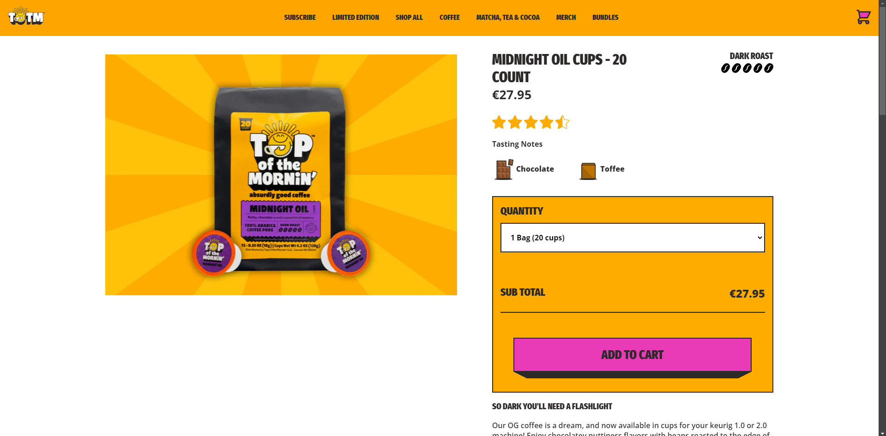

# Procesverslag
Markdown is een simpele manier om HTML te schrijven.  
Markdown cheat cheet: [Hulp bij het schrijven van Markdown](https://github.com/adam-p/markdown-here/wiki/Markdown-Cheatsheet).

Nb. De standaardstructuur en de spartaanse opmaak van de README.md zijn helemaal prima. Het gaat om de inhoud van je procesverslag. Besteedt de tijd voor pracht en praal aan je website.

Nb. Door *open* toe te voegen aan een *details* element kun je deze standaard open zetten. Fijn om dat steeds voor de relevante stuk(ken) te doen.

## Jij

  
uitwerken voor kick-off werkgroep

  ### Auteur:
  Vincent van Zeelt

  #### Je startniveau:
  Rood

  #### Je focus:
  Extra aandacht voor de responsiveness, en daarnaast zoveel mogelijk animaties en microinteracties toevoegen.  
 

## Je website

  
uitwerken voor kick-off werkgroep

  ### Je opdracht:
  Top of the Morning Coffee namaken.

  #### Screenshot(s) van de eerste pagina (small screen): 
  Top of the mornin' startpagina 
  

  #### Screenshot(s) van de tweede pagina (small screen):
  Top of the mornin' detailpagina
  
  

## Toegankelijkheidstest 1/2 (week 1)

  
uitwerken na test in 2e werkgroep

  ### Bevindingen
  TOEGANGELIJKHEID
  Tijdens de toegankelijkheid test met de screenreader kwamen de volgende bevindingen naar boven:
  - Er is geen functie om naar de maincontent te skippen, deze wordt wel aangeboden door de ingebouwde screenreader narrarator van windows, maar deze werkt niet.
  - Als je navigeert met het toetsenbord werkt is de volgorde onlogisch en incorrect waardoor het gebruik met enkel een toetsenbord heel moeilijk, al wel bijna onmogelijk is.
  - Er is op veel knoppen geen focus style, dus het is erg moeilijk te zien welke knop je op het moment geselecteerd hebt met TAB
   
  WCAG CHECKLIST
  Uit de checklist kwam naar voren dat de website op bepaalde vlakken wel verbeterd kan worden.
  - De HTML heeft enorm veel errors, deze zouden enorm verminderd kunnen worden of geheel weg gehaald kunnen worden.
  - language atribute toevoegen, deze is in de echte site afwezig.
  - viewport zoom is disabled en niet aanwezig
  - focus style is niet aanwezig
  - keyboard focus volgt niet de volgorde op de visuele layout
  - er wordt een heading level geskipt, namelijk H2
  - niet alle images hebben een alt atribute
  - skiplink is afwezig.

  Dit zijn allemaal punten die bij het namaken van de site in gedachten worden genomen om deze problemen te verbeteren. 

## Breakdownschets (week 1)

  
uitwerken na afloop 3e werkgroep

  ### de hele homepagina: 
  

  Bij deze breakdownschets heb ik niet elk element los benoemd omdat dat er erg veel zijn en het dan erg onoverzichtelijk zou worden. Ik heb zoveel mogelijk elementen benoemd, en op het moment dat deze vaker terug kwam deze dan niet meer benoemd omdat het mij enorm overbodig leek.

  ### Pagina 2, detailscherm: 
  

  Hier heb ik wederom dezelfde strategie toegepast als bij de eerste breakdownschets. algemene outlining door gedeeltes af te boxen met sections. Binnen die section heb ik zoveel mogelijk elementen benoemd waarva ik zeker ben dat ik ze ga gebruiken. tijdens het coderen kom ik er misschien achter dat ik de basis van de website anders moet opstellen dus vandaar.

## Voortgang 1 (week 2)

  
uitwerken voor 1 voortgang

  ### Stand van zaken
  Op dit moment was ik net aan klaar met de html van mijn homepagina. ik was nog niet aan de css begonnen en de tweede pagina was ik gedeeltelijk begonnen me de html.
  Tijdens het eerste voortgangsgesprek had ik niet veel concrete vragen maar meer algemene vragen.

  deze vragen luidde als volgt:
  - Klopt mijn html structuur voor hoe ik de vormgeving wil gaan doen?
  - Wat de beste aanpak is voor een image slider
  - hoe je blokjes over elkaar kan leggen. 

  ### Verslag van meeting
  - Tijdens het voortgangsgesprek kwam ik er achter dat mijn html wel goed in elkaar zat. Hier was ik dus erg blij mee, we zijn goed op weg. 
  
  - Vervolgens was ik benieuwd hoe je het beste
  een image slider met knoppen kan maken, aangezien dit best lastig is en ook javascript vereist. Hier werd mij vervolgens verteld dat een slider misschien niet de beste optie is. 
  Uit onderzoek blijkt dat veel van de content, in mijn geval afbeeldingen, die in sliders staan worden vaak niet bekeken omdat ze een actie vereisen werd mij verteld. De meeste mensen krijgen deze content dus niet te zien wat erg zonde is. Dus heb ik besloten om op de homepage geen slider te maken en de producten gewoon onder elkaar te zetten waardoor iedereen sowieso alle producten op de homepage te zien krijgt.

  - Als laatste had ik een vraag over hoe je blokjes over elkaar heen zet aangezien dit bij mijn site best vaak gebeurd. Ik dacht eerst dat dit met position: absolute; gedaan moest worden, maar dan zouden de blokjes raar gaan verschuiven op het moment dat je het venster van grootte veranderd. Daarom was het verstandig om position relative te gebruiken en de blokken met top of bottom naar boven of onder te schuiven zodat hij gedeeltelijk over een andere section uitsteekt. 

## Voortgang 2 (week 3)

  
uitwerken voor 2e voortgang

  ### Stand van zaken
  Op dit moment had ik al gedeeltelijk de css van mijn homepagina gedaan. alleen had ik de volgende vragen:
  - Plaatje in de eerste section wordt kleiner tijdens het resizen van de pagina. 
  - hoe maak je een wave
  - hoe geef je een 3d box schaduw effect. 

  ### Verslag van meeting
  - Het plaatje in de eerste section is uiteindelijk gefixed door hem meer margins en padding te geven waardoor hij genoeg blijft weergeven, ook bij een groter scherm formaat. 

  - Het maken van een wave bleek vrij lastig te zijn. Dit moest geregeld worden door of: simpelweg een png te gebruiken, of een complex stuk code te schrijven. Beide van deze oplossingen waren uiteindelijk erg lastig omdat als je een plaatje gebruikt, het positioneren ervan zodat het er niet gek uit ziet super lastig is. Daarom heb ik uiteindelijk gekozen voor code omdat ik een website had gevonden die css wave patterns voor je kon genereren. deze heb ik dus gebruikt om de waves te maken. 

  - Het 3d box schaduw effect bleek een makkelijke fix te zijn. Je kan een element namelijk meerdere boxshadows geven! Hierdoor kan je dus elke boxshadow iets langer maar minder breed maken waardoor het lijkt alof hij 3d afloopt als een knop. Dit moest echter ook gebeuren bij de waves. Maar dit wilde echt niet werken aangezien de zijkanten ook schuin af moeten lopen dus heb ik er voor gekozen om deze waves niet te gebruiken. 
  

## Toegankelijkheidstest 2/2 (week 4)

  
uitwerken na test in 9e werkgroep

  ### Bevindingen
  TOEGANKELIJKHEID:
  Qua toegankelijkheid met de screenreader is mijn website nog een stuk slechter dan de echte website omdat ik hier nog geen tijd aan besteed heb. Ik heb nog geen focusstates, skiplink of dergelijken. Ik was eerst aan de gang gegaan met de opmaak, later ga ik pas de site toegankelijk maken door het toevoegen van skiplink, focusstates en arialabels. 

  WCAG CHECKLIST:
  Uit de checklist kwam naar voren datmijn website op bepaalde vlakken nog niet alle eisen behaald.
  - Buttons zijn nog niet uniek of uitleggend. dit kan ik aanpassen door aria-labels toe te voegen ter verduidelijking.
  - ik heb nog niet bij alle afbeeldingen alt tags of toepasselijke alt tags. dit valt makkelijk op te lossen.
  - skiplink is nog niet aanwezig, maar deze ga ik nog toevoegen. 
  - links die in nieuwe windows geopend worden weergeven heb ik niet, maar al mijn links worden op dezelfde pagina geopend dus deze is niet van toepassing.
  - Dark mode is niet aanwezig

op bepaalde punten ben ik dus al vooruit gegaan op de echte website, maar op andere niet. zoals dat mijn html geen errors heeft en de echte site wel. maar ik mis bijvoorbeeld wel nog een skiplink en alt tags. deze gaan in de komende dagen toegevoegd worden. 

## Voortgang 3 (week 4)

  
uitwerken voor 3e voortgang

  ### Stand van zaken
  Op dit moment was ik zo goed als klaar met de basis css van de homepagina. Maar ik had nog wel een aantal vragen over hoe ik het beste de css van mijn detailpagina kan aanpakken.
  - Hoe zorg ik ervoor dat een bepaald gedeelte doorscrollt en de andere blijft staan.
  - hoe werken pointers ookalweer.

  ### Verslag van meeting
  - Om te zorgen dat een gedeelte blijft plakken en een andere gedeelte doorscrollt doe je met position: sticky;. Hiervoor moet je zorgen dat de sticky element kleiner is de parent en ruimte heeft. Ook moet je aangeven van hoeveel hij moet gaan plakken, dus je moet een top aangeven anders werkt het niet. Als je dit allemaal goed doet hoort het element te blijven plakken totdat zijn scrollruimte binnen de parent op is waardoor hij ook verder omhoog scrollt. Sticky kan best wel priegelwerk zijn omdat er best wel veel variable zijn die ervoor kunnen zorgen dat het niet werkt.

  

  - pointers werken heel simpel: op de plek waar je de muis een pointer wilt laten worden typ je de code: cursor: pointer;. Zo simpel is het! Toen ik het zelf aan het proberen was wilde het maar niet lukken, waarschijnlijk had ik dan ergens een typfout of iets dergelijks gemaakt want nadat het was uitgelegd werkte het wel. 

## Eindgesprek (week 5)

  
uitwerken voor eindgesprek

  ### Je uitkomst - karakteristiek screenshots:
  
  
  
  
  
  
  
  

  ### Dit ging goed/Heb ik geleerd: 
  Tijdens dit project heb ik een aantal handige dingen geleerd die mij een stuk zelfverzekerder hebben gemaakt in coderen.

  - Grid: Ik had hiervoor nog nooit grid gebruikt en het is echt super handig. Met behulp van Grid heb ik bepaalde elementen heel gemakkelijk kunnen structeren, maar ook responsive kunnen maken. Soms is flexbox gewoon net niet wat je zoekt en dan is grid super fijn. 
  
    

  - Het gebruik van directe selectoren: Hiervoor heb ik alleen maar gewerkt met classes en ID's ( wat ik nogsteeds veel lekkerder vind werken) maar nu kan ik ook met directe selectoren aan de gang. deze kunnen soms erg krachtig zijn als je over meerdere pagina's dezelfde styling op dezelfde sections met behouden. In hele sommige gevallen heb ik toch wel moeten kiezen voor een class of id omdat het echt niet komn zonder, of omdat het met directe selector echt niet wilde lukken. 

  - Het principe van parents en children: Hiervoor had ik niet echt een goed begrip van parents en children, en hoe deze informatie erg belangrijk is als je op een bepaalde manier wilt gaan stylen. Je gaat een soort van de ontzichtbare lijnen van de elementen zien. Dit maakt dat je kan gaan voorspellen wat een bepaalde styling zal gaan doen met het elementen wat het coderen een stuk logischer en gemakkelijker maakt. Dat neemt niet weg dat coderen altijd een priegelwerkje blijft. 

  ### Dit was lastig/Is niet gelukt:
  Ook zijn er meerdere dingen niet gelukt, deze heb ik dan of op een andere manier opgelost of niet gedaan:

  - Image carousel: Op mijn homepage heb ik geen imagecarousel gedaan wegens toegankelijkheids redenen, maar op mijn detailpagina had ik hem wel graag willen gebruiken. Dit is echter na veel geklooi nooit gelukt. Het werkte allemaal net niet of het zag er niet mooi uit. Toen beseft ik me dat de plaatjes van het product echt overbodig waren en dat maar 2 plaatjes relevant waren. Daarom had ik gekozen om een flip te maken op het plaatje zodat je er op kan klikken en het plaatje dan omdraaid en het andere plaatje laat zien. Dit is een stuk simpeler, maar even effectief.

     

  - Wavy box shadows: Het was uiteindelijk gelukt om een wavy border te maken met behulp van 'CSS wavy border generator'. Deze moest vervolgens ook een dikke shadow krijgen net zoals de knoppen. Maar aangezien de waves gemaakt worden met radial gradients en masks zou dit niet werken. De enige manier om het dan te maken is met behulp van images maar dit wilde ook niet werken. Hier heb ik dus besloten om de waves die een schaduw hoorde te hebben weg te laten. De andere waves zonderschaduw heb ik wel op de site gehouden want deze zagen er super tof uit!

   

 - Background-image swap: Ik wilde background image bij een groot formaat swappen naar een andere image omdat die beter bij het formaat past. Dit wilde gewoon echt niet werken. Ik heb meerdere tutorials opgezocht van hoe het moest maar het is nooit gelukt. De tutorials zeiden allemaal dat je simpelweg een andere url moest aanroepen in de mediaqueries maar dat werkte gewoon niet en heb ik dus gelaten aangezien het er nogsteeds prima uitziet zo, maar het kon met een ander plaatje iets netter zijn. 
 
 
 
  ### Laatste bevindingen:
  Als laatste zijn hier nog een aantal dingen die ik graag had aangepast bij meer tijd of als ik wist hoe ik zou moeten aanpassen.
  
  - Classes op body van homepage en detailpage: Om met het zelfde css bestand 2 verschillende pagina's te stylen kan je een class geven aan de body van een van de pagina's. Dit heb ik dus gedaan met de detailpagina, maar om een of andere manier wilde sommige stylings van de homepage gewoon niet genegeerd worden op de detailpagina wat mij uiteindelijk heeft geforceerd om ook een class op de body van de homepage te zetten en een aantal van de vervelende elementen op de homepage met de class aan te roepen en te stylen. 

  - Goeie volgorde van headings: Ik kwam er heel laat in het project pas achter dat de volgorde van headings afhankelijk is van de volgorde van de pagina en niet afhankelijk is op de manier waarop de headings gestyled zijn. Aangezien we met directe selectoren aan de gang waren zou het een enorm groot gezeik zijn om dit allmaal aan te passen omdat je dan ook alle css daarvoor mag gaan aanpassen. 
  Op mijn detailpagina heb ik wel de headings goed gezet omdat ik die pagina ben gaan stylen nadat ik er achter kwam dat het zo zat. 

  - toevoegen van een darkmode: Aangezien mijn website een zeer uitgesproken stijl heeft met velle gekleurde plaatjes die bijdragen aan het kleurenpalet en dergelijken is het niet zo simpel om een darkmode te maken. Als ik dit wel goed had willen doen had ik alle plaatje zelf darkmode moeten maken zodat het zou passen bij de donkere stijl. Als ik meer tijd had gehad had ik dit uiteraard gedaan omdat het een zeer handige feature is van een website. 

  - responsive maken: Toen ik klaar was met de css van beide pagina's werd het tijd om ze responsive te maken. Toen kwam ik er achter om bepaalde dingen horizontaal te stylen wat veel op desktop formaten gebeurd je veel divs moet gaan toevoegen om dit gewenste resultaat te behalen. als ik binnen een section bepaalde blokken tekst naast elkaar wil flexen, maar niet het plaatje, dan moeten die blokken teksten in een div gezet worden zodat die geflext kunnen worden. Dit vond ik dus erg tegenvallen aangezien ik zo lekker ging met het niet gebruiken van divs, maar dat is na het responsive gemaakt te hebben een stuk meer geworden.

## Bronnenlijst

  
continu bijhouden terwijl je werkt

  Nb. Wees specifiek ('css-tricks' als bron is bijv. niet specifiek genoeg). 
  Nb. ChatGpT en andere AI horen er ook bij.
  Nb. Vermeld de bronnen ook in je code.

  1. [Wavey shape generator](https://css-generators.com/wavy-shapes/)
  2. [CSS Flip card effect](https://www.youtube.com/watch?v=OV8MVmtgmoY/)
  3. [Codepen hamburger menu](https://codepen.io/shooft/pen/VwJXNEg)

